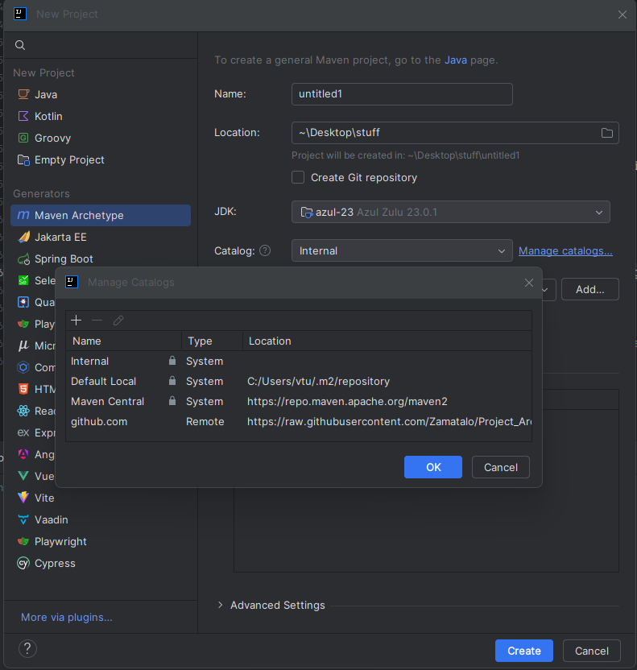

# Archetype Template

## What is an Archetype?

An **Archetype** serves as a foundation for standardized and reusable project structures. In this case, it defines the
standards for directories, configurations, and basic dependencies to ensure consistency and efficiency when starting new
projects. The goal is to create a template that can be customized to our specific needs and provides a quick start for
project development.

## Maven Archetype Documentation

### Structure

The following structure provides a clear separation of concerns within a project and serves as the basis for a clean
architecture:

### Description of Key Components:

#### **Parent**

The parent container for the entire project. It defines dependencies and build configurations that apply to all modules.

#### **Logic (Business Logic)**

- **service**: Contains the business logic of the project.
- **security**: Responsible for security aspects like authentication and authorization.
- **config**: Configuration modules required throughout the system.
- **utility (optional)**: Helper classes and methods for recurring logical tasks.
- **controller**: For recieveing api calls

#### **Shared**(Everything that is used across the project)

- **model**: Shared data models.
- **client**: Interfaces for external communication (e.g., APIs).
- **dto**: Data transfer objects for communication between systems.
- **utility (optional)**: General helper functions that can be used multiple times.

#### **Persistence (Data Access Layer)**

- **repo**: Repositories for database operations.
- **entity**: Database entities representing tables.
- **dao**: Data Access Objects for abstracting database interactions.

#### **UI (User Interface)**

- **config**: Configuration for the UI application.
- **model (optional)**: Special models for the presentation layer.
- **utility (optional)**: Helper classes for the UI.

### Directory Overview
```plaintext
.
└── resources
    ├── META-INF
    │   └── maven
    │       └── archetype-metadata.xml      # Metadata for Maven archetype
    └── archetype-resources
        ├── README.md                       # Project documentation
        ├── __rootArtifactId__-Logic        # Module for business logic
        │   ├── pom.xml                     # Module's POM file
        │   └── src
        │       └── main
        │           ├── java
        │           │   ├── LogicApplication.java  # Main application class
        │           │   ├── config                  # Configuration files
        │           │   ├── controller             # Controller classes
        │           │   │   └── UserController.java  # Example controller
        │           │   ├── security               # Security configuration
        │           │   │   └── SecurityConfig.java # Security config
        │           │   ├── services               # Service classes
        │           │   │   └── UserService.java    # Business logic for user
        │           │   └── utility                # Helper utilities
        │           │       └── UserMapper.java    # Mapper for user data
        │           └── resources
        │               └── application.properties  # Configuration for the application
        ├── __rootArtifactId__-Persistence    # Module for data persistence
        │   ├── pom.xml                     # Module's POM file
        │   └── src
        │       └── main
        │           └── java
        │               ├── dao                # Data Access Object classes
        │               ├── entity             # JPA entity classes
        │               │   └── UserEntity.java  # Example entity class
        │               └── repo                # Repository interfaces
        │                   └── UserRepository.java  # User data repository
        ├── __rootArtifactId__-Shared        # Shared module with common models and DTOs
        │   ├── pom.xml                     # Module's POM file
        │   └── src
        │       └── main
        │           └── java
        │               ├── client              # API client classes
        │               │   └── ApiClient.java   # API client example
        │               ├── dto                 # Data Transfer Objects (DTOs)
        │               │   └── UserDTO.java     # Example DTO
        │               ├── model               # Shared models
        │               └── utility             # Utility classes
        ├── __rootArtifactId__-UI            # Module for the UI layer (Vaadin, etc.)
        │   ├── pom.xml                     # Module's POM file
        │   └── src
        │       └── main
        │           └── java
        │               └── com
        │                   └── example
        │                       └── ui
        │                           ├── config          # UI configuration
        │                           ├── model           # UI-specific models
        │                           └── utility         # UI helper classes
        └── pom.xml                         # Parent POM file for the entire archetype template
```
---
## Features

- **Modular Architecture**: Organized structure with a clear separation of responsibilities.
- **Maven Build**: Pre-configured Maven build setup for easy project setup.
- **Seamless Integration**: Easily integrates into existing Maven projects.
- **Scalable**: Suitable for projects of any size, from small to large-scale enterprise applications.

## Getting Started

### 1. Clone the Repository


Or clone and generate it in your project:
```bash 
git https://bitbucket.hup.de/scm/~vtu/spring-boot-template.git
cd spring-boot-template
```

```bash 
mvn clean install
```

```bash
mvn archetype:generate \
  -DarchetypeGroupId=com.example \
  -DarchetypeArtifactId=hup-project-archetype \
  -DarchetypeVersion=1.0-SNAPSHOT \
  -DgroupId=com.myproject \
  -DartifactId=my-new-project \
  -Dversion=1.0.0-SNAPSHOT
```
Or alternatively, you can add archetype-catalog.xml as custom catalog via IntelliJ:



```plaintext
https://raw.githubusercontent.com/Zamatalo/Project_Archetype/refs/heads/master/src/main/resources/META-INF/maven/archetype-catalog.xml
```

